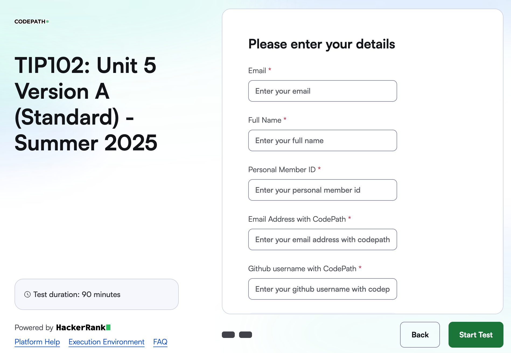
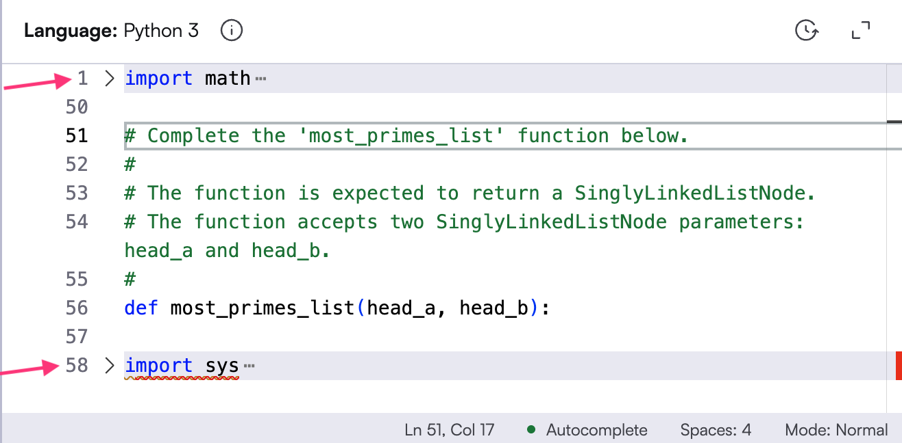
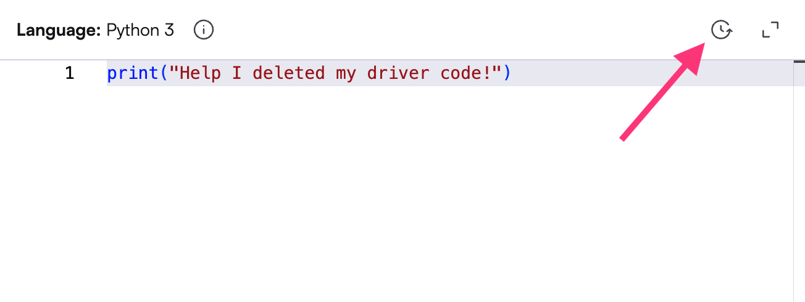
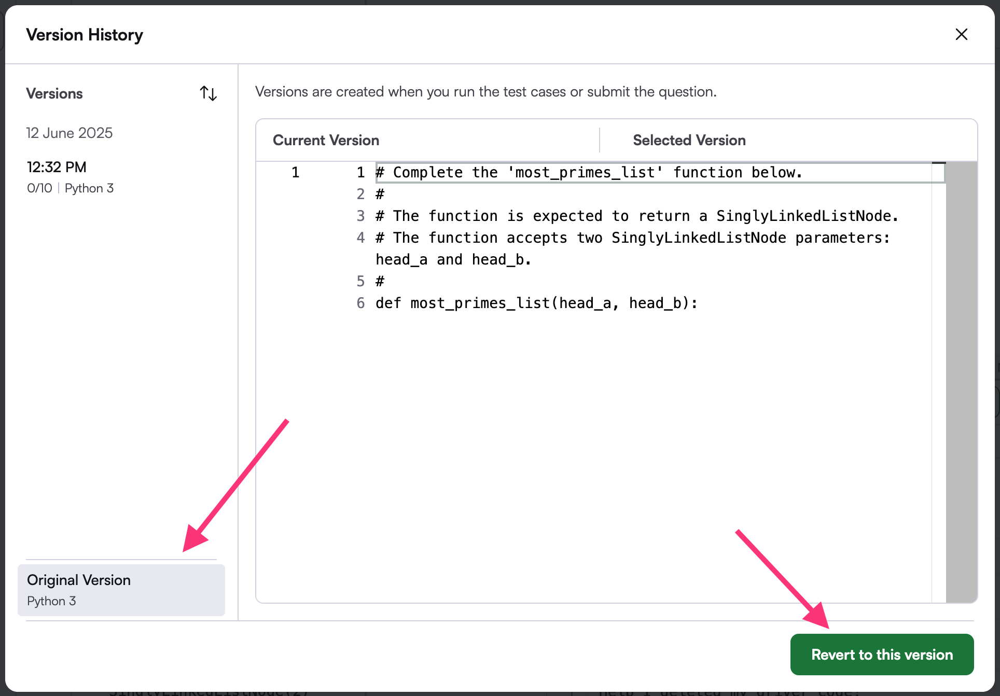
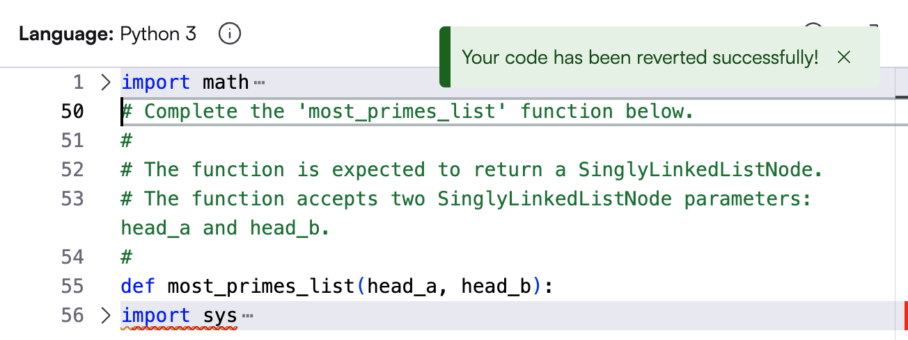
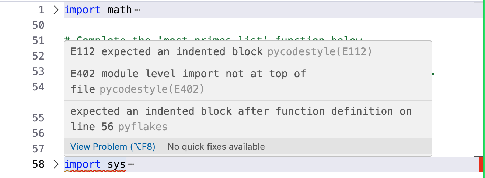
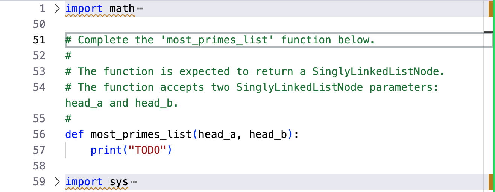
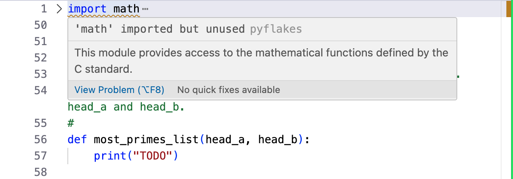
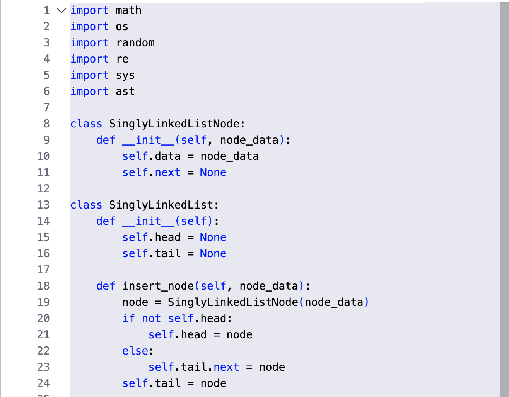
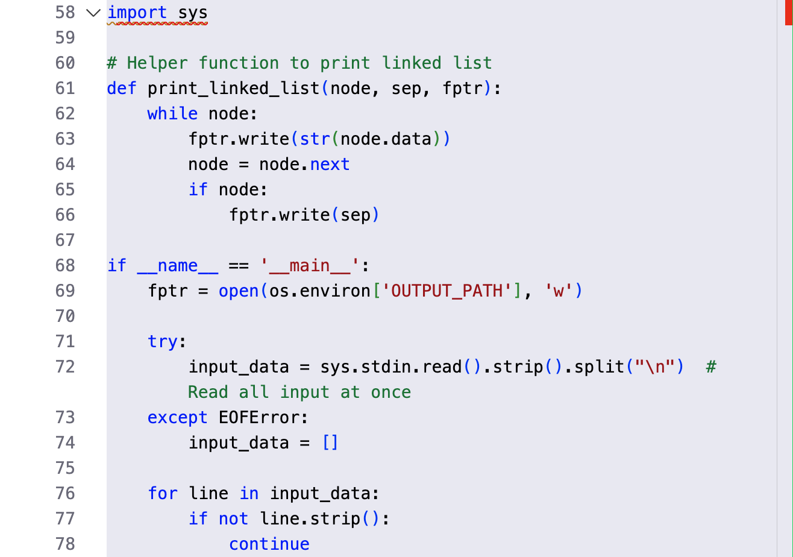

[https://courses.codepath.org/courses/tip101/pages/hackerrank_success_guide#feedback-modal](https://courses.codepath.org/courses/tip101/pages/hackerrank_success_guide#feedback-modal)
## HackerRank Success Guide


In this course, you will need to pass HackerRank assessments in order move on to the next unit. This guide will walk you through how to get the most possible points on your HackerRank assessments.


**Want to learn all the tricks?** → Read through the **🗺️ Steps to Success** section!


**Think you might know it all?** → Test your knowledge in the **🎒 Check Your Readiness** section!


---


### 🗺️ Steps to Success


### Step 1: Make sure we can find your score


When you click on a link to open a HackerRank assessment, you will need to fill out a login form. It will look something like this:


[](Assets/hr_login.png)


**🚀 Success Tip:**


Fill out the form using the **same information** that appears in your CodePath profile.


**👤 My CodePath Profile**


- To view your **email address**, **full name**, and **GitHub login**, click your profile picture in the top right corner of the CodePath website, then click "Profile".

- To find your **Personal Member ID#**, look in the top left of the Course Portal, beneath the name of the course.


**⚠️ Help!**


### What if any of the above information is wrong?


*To update your information, click your profile picture in the top right corner of the CodePath website, then click "Edit Profile".*


**IMPORTANT:** Please avoid changing your email address or GitHub username mid-semester, as this could cause issues with your HackerRank submissions. If you must change your email address, please reach out to [support@codepath.org](mailto:support@codepath.org).


### What if I accidentally use the wrong email?


*If you accidentally complete the exam on the wrong account, please reach out to [support@codepath.org](mailto:support@codepath.org), using professional language and including both the correct and incorrect email address in your message.*


### Step 2: Complete all multiple choice questions


The multiple choice section of your HackerRank assessment is most likely very similar to other assessments you have taken in the past.


**🚀 Success Tips:**


- **Read each question carefully**: Make sure you understand what is being asked before selecting an answer.

- **Use the process of elimination**: If you are unsure about an answer, try to eliminate the options that you know are incorrect.

- **Trace through the code**: If a question involves code, read through it carefully and try to understand what it does before selecting an answer.


### ⚠️ What if I think a question might have an error?

*If you think a question might have an error, complete the test as normal. After you receive your test report, ask your TF or instructor if they can explain something you might have missed.*
*If they agree that there is an error, please reach out to [support@codepath.org](mailto:support@codepath.org). Be sure to use professional language and include a link to the exam, which question, and an explanation of why you think it is incorrect.*


### Step 3: Understand how coding problems are scored


In this course, coding problems are graded on an **all-or-nothing basis** — which means that you must ***successfully pass 100% of test cases*** in order to receive points for that coding problem.


**🚀 Success Tip:**


- Before submitting your code, make sure to test it thoroughly.

- Consider edge cases, such as empty inputs, large inputs, and special characters.

- Try using HackerRank's **Test against custom input** feature to run your code against specific test cases you can think of.


**⚠️ Help!**


### Wait, so you're saying I can't get any partial credit?


That's correct. In this course, you must pass all test cases for a coding problem in order to receive any credit for it.


### Why do you do it this way?


This policy mirrors standard expectations in the software engineering industry, where code is typically not considered complete — or deployable — unless it works fully and reliably. It’s not a quirk of our course; it reflects the broader professional norm. Writing code that "mostly works" is rarely good enough when correctness, reliability, and edge cases matter. This policy helps you build the habits expected of working engineers.


### Why did HackerRank flag a code similarity?


HackerRank has begun to auto-detect suspicious activity based on how similar your solution is to others who have submitted that problem. Although a good idea in theory, in practice this creates many false positives when there are only so many ways a solution can be written. As long as your score on the problem is not affected, feel free to ignore this flag!


### Step 4: Recognize coding problem driver code


When you open a HackerRank **coding problem**, you may be surprised to see that the code editor is **📦 not completely empty**. Above and below your code editor, you will see **provided driver code**.


By default, the driver code is **collapsed**, so you will only see one line for each:


[](Assets/hr_code_editor.png)


In the above screenshot, the driver code is shown on lines 1 and 58.


**🚀 Success Tip:**


When writing your solution, **do not modify the driver code**. If changed, it may cause your submission to be graded incorrectly, or not run at all!


**⚠️ Help!**


### What if I accidentally modify the driver code?


It's okay! If you accidentally modify the driver code, you can always restore your code back to a previous state.


First, make sure you copy any code you don't want to lose! Then start by clicking the **⏰ Version History** button in the top right corner of the code editor:


[](Assets/hr_corrupted.png)


Next, select the version of the code you want to restore. In our example, we'll select the **Original Version** on the bottom-left, then click the **Revert to this version** button:


[](Assets/hr_revert_version.png)


This will restore the driver code to its original state, and you can continue working on your solution.


[](Assets/hr_restored.png)


### The first line of the footer code has an error!


Did you already notice this in our screenshot above? If so, great eye!


Often when you first open a problem in HackerRank, the first line of the footer code will be underlined red with the following error:


[](Assets/hr_error.png)


This is actually not an issue with the footer code itself, but due to the fact that your provided function currently has **no lines of code**. If you add any code to the function, the error will go away, like this:


[](Assets/hr_code_editor_print.png)


### There's a yellow line under the import statements!


This is safe to ignore. The yellow line is a warning that the import statements are not being used in your code. This is common in HackerRank problems, as the header code may import modules that are not needed for your specific solution.


[](Assets/hr_warning.png)


**🔍 Learn More**


### What is the header code and why is it there?


The header code contains "support code" that helps the rest of the program run. We use this section for two primary purposes: Importing modules and defining functions. Here's an example:


[](Assets/hr_header.png)


- **Importing modules**: The header code may import modules that may be helpful for your solution.

- Just because a module is imported does not mean it is necessary to solve the problem. Some modules may be imported to support the footer code or may be only imported as a suggestion.

- If desired, you can add your own import statements at the top of your white code editor box, just below the header code.

- **Defining classes and functions**: The header code may also define classes and functions.

- This is especially common in Data Structures problems.

- In the above example, the problem requires working with linked lists, and the header code is where the definition of the linked list class resides.


### What is the footer code and why is it there?


The footer code contains the "driver code" that supports running your code against all of the test cases in HackerRank, as well as helper functions that assist in converting between strings and data structures.


[](Assets/hr_footer.png)


It checks your program's output against the expected output and reports whether your code passed or failed each test case. It also handles formatting the test case data correctly for the problem, and ensures that your code meets the input and output requirements.


**⚠️ Do not modify the footer code**. If you do, it may cause your submission to be graded incorrectly, or not run at all!


### Step 5: Avoid Python indentation errors


The Python programming language is very particular about how tabs and spaces are used to organize code. If you are getting an indentation error, please go through your code and make sure you are using a consistent number of spaces or tabs before each line.


Click to view each example below, and make sure you understand why each one is correct or incorrect.


**Examples:**


### 🟢 Example 1: Happy Case


This code uses 4 spaces to indent each line:


```python
def my_function():
    print("Hello, World!")       # 4 spaces
    if True:                     # 4 spaces
        print("Coding is fun!")  # 8 spaces (4 + 4)
```


### 🔴 Example 2: Error Case


This code will cause an Indentation error:


```python
def my_function():
    print("Hello, World!")       # 4 spaces
   if True:                      # 3 spaces (ERROR)
        print("Coding is fun!")  # 8 spaces (4 + 4)
```


### 🔴 Example 3: Edge Case (SNEAKY)


‼️ Watch out! If you use a mix of tabs and spaces, your code may visually LOOK correct, but it can still cause an indentation error:


```python
def my_function():
    print("Hello, World!")       # 4 spaces
    if True:                     # 4 spaces
	print("Coding is fun!")  # tab (ERROR)
```


**🚀 Success Tip:**


We recommend using **4 spaces** for each indentation level in Python, and to avoid using tabs altogether.


### Step 6: Remove debug print statements before submitting


When working on a coding problem, it's common to add `print()` statements to help you understand what your code is doing. However, HackerRank grades your submission by comparing your code's **exact output** against the expected output. Any extra output — including debug print statements — will cause your test cases to fail.


**🚀 Success Tip:**


Before submitting your code, **remove all debug print statements** from your solution. Only the output required by the problem should be printed — which is typically handled by the driver code in the footer.


**⚠️ Help!**


### My code seems correct but all my test cases are failing — what's going on?


One common cause is leftover debug print statements. Double-check your code for any `print()` calls you added while testing, and remove them before resubmitting. Even a single extra print statement can cause every test case to fail.


---


### 🎒 Check Your Readiness


### Think you're ready to go? Click here to test your understanding! (Not graded, refresh page to reset)


  When you open a HackerRank assessment, what email address should you use to log in?


  In order for us to find your HackerRank score, you must use the same email address that you used to sign up for CodePath. Please review Step 1 for more information.


  If you find an error in a HackerRank multiple choice question, what should you do?


  In programming, missing one small detail can make a question seem totally wrong. After your exam, check with a TF or instructor first before reporting. Please review Step 2 for more information.


  If you complete 9 out of 10 test cases, how many points will you receive for that coding problem?


  In alignment with industry expectations, you must pass all test cases for a coding problem in order to receive credit for it. Please review Step 3 for more information.


  When solving a HackerRank coding problem, how can you tell what code is header or footer "driver code"?


  The provided header and footer code is shown in HackerRank by a gray background. Modifying either may cause your submission to be graded incorrectly, or not run at all. Please review Step 4 for more information.


  When solving a HackerRank coding problem, what happens if you delete the provided driver code?


  The provided driver code (header and footer) is there to help you run your code against the test cases. If you accidentally delete it, you can restore it using the Version History button in the top right corner of the code editor. Please review Step 4 for more information.


  If the code you are writing is giving an Indentation Error, what should you do first?


  Python is very particular about how tabs and spaces are used to organize code. If you are getting an indentation error, please go through your code and make sure you are using a consistent number of spaces or tabs before each line. Please review Step 5 for more information.


  Your code looks correct, but all of your HackerRank test cases are failing. What is a likely cause?


  HackerRank grades your submission by comparing your code's exact output against the expected output. Extra print statements cause unexpected output that will fail every test case. Remove all debug print statements before submitting. Please review Step 6 for more information.
