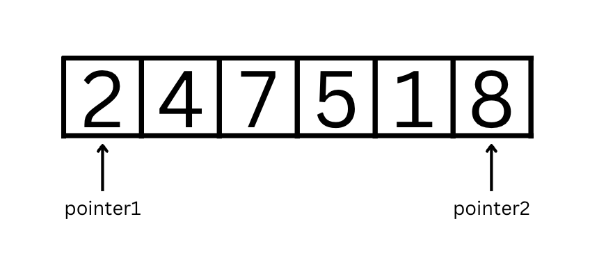
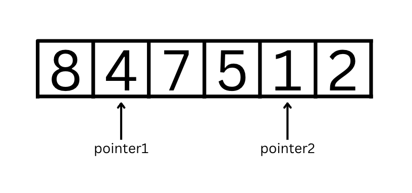
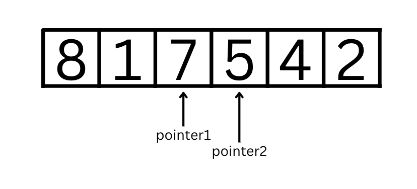
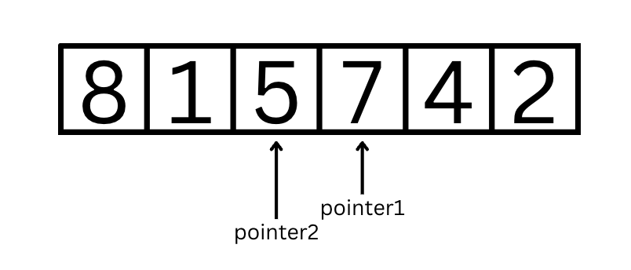
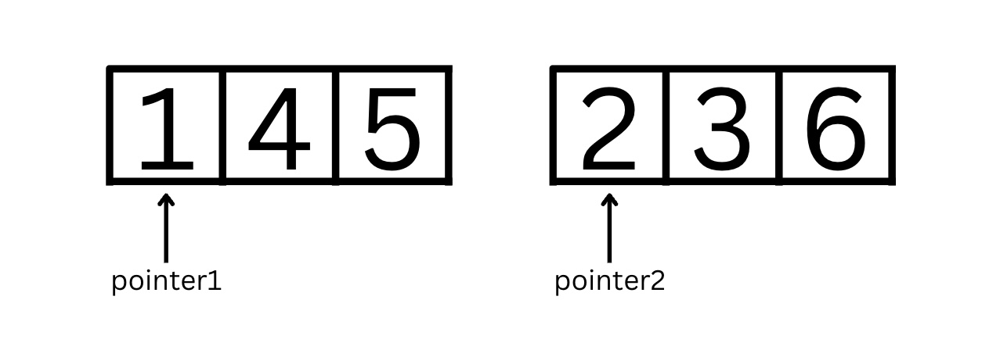
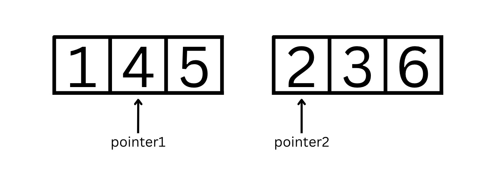
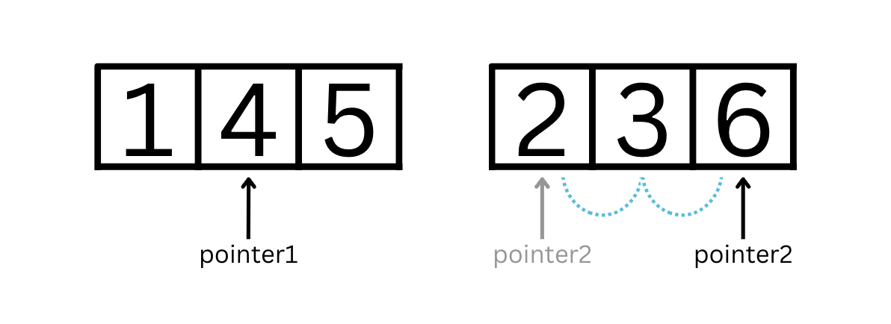
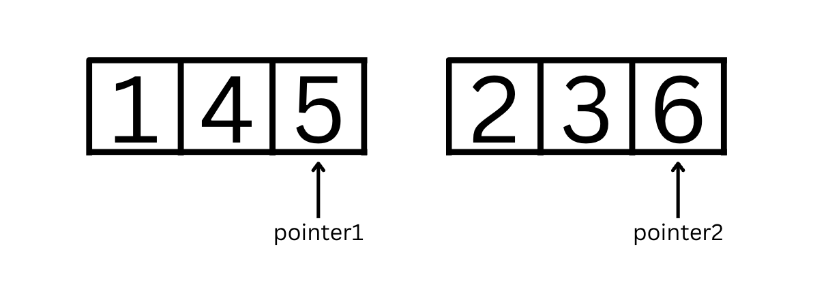
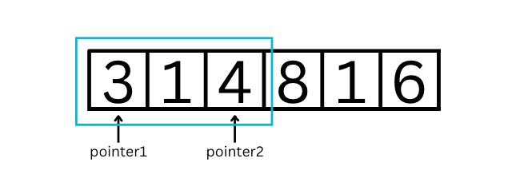
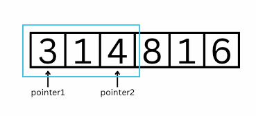

[https://courses.codepath.org/courses/tip101/unit/4#feedback-modal](https://courses.codepath.org/courses/tip101/unit/4#feedback-modal)
## Unit 4 Cheatsheet


Here’s a quick reference sheet for Unit 4. While not an exhaustive list, it highlights the key syntax and concepts you’ll use in this unit, plus a few optional ideas that may help with problem-solving. You’re still expected to know required material from earlier units.
Sections are labeled for clarity:


- ✅ In-Scope: May appear on the assessment

- 💡 Not In-Scope: Useful, but not required


### 🎯 Unit Goals


- Use the two-pointer approach to solve problems


### General Concepts ✅ In-Scope


### The Two Pointer Approach


The **two-pointer approach** is a common technique in which we initialize two pointer variables to track different indices or places in a list or string and move them to new indices based on certain conditions.


#### Opposite Direction Pointers


In the most common variation of the two-pointer approach, we initialize one variable to point at the beginning of a list and a second variable/pointer to point at the end of list. We then shift the pointers to move inwards through the list towards each other, until our problem is solved or the pointers reach the opposite ends of the list.





In the above case, `pointer1 = 0` and `pointer2 = 5`. Let's say we wanted to **reverse the integer list**. The two pointers would allow us to swap the values at each pointer and then move inwards to continue swapping. The next iteration would have `pointer1 = 1` and `pointer2 = 4` to swap those values.





After those values are swapped, the next iteration would have `pointer1 = 2` and `pointer2 = 3` to swap those values.





Finally, we know to stop once `pointer1 == pointer2` (*they are at the same index, mostly when the length of the list or string is odd*) or when `pointer1 > pointer2` (*the pointers have intersected, and pointer1 is past pointer2*).


The end result has the integer list completely reversed:





Example Usage:


```python
left_pointer = 0
right_pointer = len(word) - 1
while left_pointer < right_pointer:
    pass
    left_pointer += 1
    right_pointer -= 1
```


#### Same Direction Pointers


Another common variation of the two-pointer approach is to point one pointer at the beginning of one string or list and a second pointer at the beginning of a second string or list, then increment each pointer conditionally to solve a problem. This allows us to keep track of values in two lists at the same time.


For example, let's say we want to merge two *sorted* lists. Since each list is sorted, we can start off by comparing the values at the beginning of the list with both `pointer1 = 0` and `pointer2 = 0`:





Then, we would increment the pointer of the value that was less and put into the merged list. Currently, the merged list would have `[1]` and `pointer1 = 1` and `pointer2 = 0`.





Comparing the pointer values, `pointer2` is incremented twice in a row and the merged list would have `[1,2,3]`





Now, with `pointer1 = 1` and `pointer2 = 2` we compare values again and `pointer1` is incremented.





After the last comparison, we have our sorted merged list as `[1,2,3,4,5,6]`. Unlike the previous variation with the 2 pointers pointing to the same list, we know to stop because both pointers have reached the end of their respective lists.


Example Usage:


```python
    nums1_pointer = 0
    nums2_pointer = 0

    while nums1_pointer < len(nums1) and nums2_pointer < len(nums2):
        # <if conditional>
            # <operation>
            nums1_pointer += 1
        else:
            # <operation>
            nums2_pointer += 1
```


#### Sliding Window


The **sliding window technique** is an extension of the 2-pointer approach. It is an algorithm often used to find a subarray or substring that meets certain criteria. It works by initializing two pointers to point at the start and end of a ‘window’ or subsection of the string/array at a time. The pointers are then incremented to slide the window and examine a different subarray or substring.


Let's say we want to find the total sum for a sublist of length 3 in a list. Here, `pointer1 = 0` and `pointer2 = 2`:





Then, as we move through the list, we move the entire "window".





Example Usage:


```python
for i in range(len(nums) - 2):
    # Extract the current window of size 3
    window = nums[i:i+3]

    # implement operations here
    pass
```


### Unpacking


**Unpacking** is a method of assigning multiple variables at once, commonly used with the 2-pointer approach.


To assign multiple variables at once, we can use the following syntax to assign the value `1` to `a` and the value `2` to `b`:


```python
a, b = 1, 2
```


If there is an incorrect number of variables for the values given, a `ValueError` will be thrown. This can be applied to when swapping values (*as seen in the **Beginning and End** 2-Pointer Approach*):


```python
pointer_one, pointer_two = pointer_two, pointer_one
```


Note that this swaps the **index** each pointer points to, and not the **value**. To swap values in a list, we would use:


```python
nums[pointer_one], nums[pointer_two] = nums[pointer_two], nums[pointer_one]
```


Unpacking is not limited to one data type. It also works with strings, and we can even assign multiple values from a list of strings:


```python
inventory = [["apples", 3], ["carrots", 5]]
[[item, quantity], [item2, quantity2]] = inventory
# [item, quantity] << ["apples", 3]
# [item2, quantity2] << ["carrots", 5]
```

[https://courses.codepath.org/courses/tip101/unit/4#feedback-modal](https://courses.codepath.org/courses/tip101/unit/4#feedback-modal)
## Unit 4 Resources


### Session Recordings


Check out our live session recordings:


- [Instructor Led Sessions Playlist](https://vimeo.com/showcase/12239071?fl=so&fe=fs) | Passcode: **codepath**

- [Study Hall Playlist](https://vimeo.com/showcase/12252539?fl=so&fe=fs) | Passcode: **codepath**

- [Fix-it Garage Playlist](https://vimeo.com/showcase/12252541?fl=so&fe=fs) | Passcode: **codepath**


**Note:** It may take up to 24-48 hours after the session has concluded to appear on the playlist.


### Guides & Cheatsheets Links


#### Breakout Solutions


- [Unit 4 Breakout Problem Solutions](https://github.com/codepath/compsci_guides/wiki/TIP101-Unit-4)


#### Cheatsheet


- [Unit 4 Cheatsheet](https://courses.codepath.org/courses/tip101/unit/4#!cheatsheet)


#### Mock Interview Questions


Below is a list of additional interview questions spanning *all units* you can work on for additional practice.


- [Mock Interview Questions](https://courses.codepath.org/snippets/tip101/mock_interview_questions)
