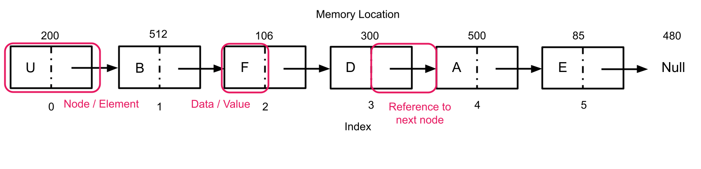

[https://courses.codepath.org/courses/tip101/unit/5#feedback-modal](https://courses.codepath.org/courses/tip101/unit/5#feedback-modal)
## Unit 5 Cheatsheet


Here’s a quick reference sheet for Unit 5. While not an exhaustive list, it highlights the key syntax and concepts you’ll use in this unit, plus a few optional ideas that may help with problem-solving. You’re still expected to know required material from earlier units.
Sections are labeled for clarity:


- ✅ In-Scope: May appear on the assessment

- 💡 Not In-Scope: Useful, but not required


### 🎯 Unit Goals


- Define and use classes and objects

- Use class attributes and methods to manage object data

- Create and manipulate a singly linked list

- Solve problems requiring traversal of a singly linked list


### General Concepts ✅ In-Scope


### Object Oriented Programming


Object-oriented programming (OOP) is a programming paradigm that uses 'objects' and their interactions to build applications and computer programs. We can think of objects as virtual representations of real life object or data type. Python offers us many built-in objects or data types like integers (Python representation of a whole number), floats (Python representation of a decimal number), and strings (Python representation of a chunk of text), but the real magic of OOP is that it allows us to also create our own data types!


#### Classes


Classes are the mechanism through which we can design our own custom data types. A class is a blueprint for our new data type/object and defines the characteristics and functionality that every object of that class will have. Classes are comprised of two things:


- **properties** variables that describe *characteristics* of our object.

- **methods** functions that define *behaviors* of our object.


You can think of properties like adjectives that describe our object and methods like verbs that describe actions that our objects can take or that we can perform on our object.


#### Defining a Class


Let's look at an example of using a class to create a virtual representation of a dog. We can create a `Dog` class by representing a dog as a combination of its name, breed, and owner - these are the `Dog` class' properties.


```python
class Dog:
    def __init__(self, name, breed, owner):
        self.name = name
        self.breed = breed
        self.owner = owner
```


#### Instantiating a Class


The `__init__()` function, also called the *constructor* describes how to build a new object or *instance* of a class. The job of the constructor is to assign values to object properties. Like a normal function, constructors can have parameters. The `Dog` constructor above takes in three arguments: the `name` of the dog we are creating, the `breed` of the dog, and the `owner` of the dog and assigns the argument values to the class properties of the same name.


The constructor (and all class methods) includes a special parameter `self`, which refers to the current instance of the class that is being created. We do not need to pass in a value for self when we call the constructor.


We call constructors differently than we call normal functions. Instead of calling the constructor by writing its function name `__init__()`, we call it by using the name of the class. For example, we can create a new `Dog` object/instance with the following:


```python
my_dog = Dog('Fido', 'Cocker Spaniel', 'Ada Lovelace')
```

The above code creates a dog whose name is `'Fido'`, breed is `'Cocker Spaniel'` and owner is `'Ada Lovelace'`.


#### Class Properties


We can access properties of an object using dot notation: `object_name.property_name`.


```python
print(my_dog.name) # Prints Fido
```

In the above example, we stored our Dog instance in the variable `my_dog`, so `my_dog` is the name of our object. The property we're interested in printing is the dog's name so we place `name` after `my_dog` separated with a `.`.


#### Class Methods


Methods are just functions attached to objects. We can define a method by using the same syntax we use to define a function, but indenting it inside of a class definition. All methods take in the parameter `self`, referring to the current instance of the class.


```python
class Dog:
    def __init__(self, name, breed, owner):
        self.name = name
        self.breed = breed
        self.owner = owner

    def call_dog(self):
        print(f"Here {self.name}!")
```

We can call a class method using the same dot notation we do for properties: `object_name.method_name()`.


```python
my_dog.call_dog() # Prints 'Here Fido!'
```

Methods can take parameters in addition to self.


```python
class Dog:
    def __init__(self, name, breed, owner):
        self.name = name
        self.breed = breed
        self.owner = owner

    def call_dog(self):
        print(f"Here {self.name}!")

    def command_trick(self, trick):
        print(f"{self.name}, {trick}!")
```

These parameters need to be passed arguments as we would with a normal function.


```python
my_dog.command_trick("roll over") # Prints 'Fido, roll over!'
```


### Linked Lists


#### Linked Lists vs Arrays


At a surface level, linked lists and Python lists are equivalent. They both allow us to store multiple items of any data type together as an ordered collection of data.


Linked lists and normal lists differ in how they store each item they contain within memory.


Normal Python lists store each consecutive element in an array. For example, say we have the list `['U', 'B', 'F', 'D', 'A', 'E']` with element `'U'` stored at memory location 200. Elements `'B'` through `'E'` would be stored at memory locations 201 through 205 respectively.


In contrast, each element of a linked list can be stored in non-related memory locations. The first item in a linked list might be stored at memory location 200, and the second item might be stored at memory location 512.


So that we can find each element of the list, each item in the list not only stores the data it wants to hold like `'U'` or `'B'`, but also a reference to where the next item in the list is stored in memory.





The reason both lists and linked lists exist, is because linked lists have a lower time and space complexity for certain operations. Follow your curiosity and do some independent research if you'd like to explore this more!


#### Defining a Linked List


Linked lists are not a built-in data type in Python, therefore we must define a class to build a linked list.


Each element of a linked list is called a *node*. A node consists of a *value* equivalent to an element's value in a normal list, as well as a *pointer* or reference variable to the next node in the list.


A `Node` class might commonly look like the following.


```python
class Node:
    def __init__(self, value, next=None):
        self.value = value
        self.next = next
```

The `next` property is the pointer to the next node in the list. `next` is either another `Node` instance or `None` meaning there is no node after the current node. By default, `next` is `None`.


In technical interviewing scenarios, it is likely that you will only be provided with a `Node` class, and a variable containing the first node in the linked list (also called the head of the list).


In some scenarios, you may also be given a linked list class that includes a reference to the `head` of the list as an attribute and operations commonly performed on a list, such as appending a new node, as methods.


```python
class LinkedList:
    # Constructor.
    def __init__(self):
        # The first node in the linked list.
        # The head is either a Node object or None if the list is empty.
        self.head = None

    # Method. Adds a new node with the specific data value to the beginning of the linked list.
    def add_first(self, value):
        pass

    # Method. Adds a node with specified value to the end of the list.
    def append(self, value):
        pass

    # Method. Returns the length of the list.
    def length(self):
        pass

    # Method. Returns the value at a given index in the linked list.
    # Index count starts at 0.
    # Returns None if there are fewer nodes in the linked list than the index value.
    def get_at_index(self, index):
        pass
```


#### Linked List Traversal


Most interviewing problems involving linked list, will require you to traverse a linked list. Traversing a linked list means sequentially accessing each element of the list, starting with the first (head) node.


To perform a traversal, take the following steps:


- Create a pointer `current` and initialize it to the first node in the list.

- Create a while loop that continues iterating as long as the `current` node is not `None` (aka as long as there are still nodes in the list we haven't traversed).

- In the body of the while loop:

- perform whatever actions you would like to the current node (e.g. printing the current node's value)

- update `current` to point at the next node in the linked list


```python
class Node:
    def __init__(self, value, next=None):
        self.value = value
        self.next = next


    def traverse(head):
        current = head
        while current:
            # can perform other operations here
            current = current.next
```


### Bonus Concepts 💡 Not In-Scope


The following syntax is nice to know and may improve your code readability or help you solve certain problems more easily. However, they are not *required* to solve any of the problems in this unit. These are **not in scope for the Unit 5 assessment**, and you do not need to memorize them! Click on the function to read more about how to use it.


- [**`lst.extend(x)`**](https://www.w3schools.com/python/ref_list_extend.asp) Modifies the given list by appending all elements in iterable `x`.

- [**`lst.reverse()`**](https://www.w3schools.com/python/ref_list_reverse.asp) Reverses the given list.

[https://courses.codepath.org/courses/tip101/unit/5#feedback-modal](https://courses.codepath.org/courses/tip101/unit/5#feedback-modal)
## Unit 5 Resources


### Session Recordings


Check out our live session recordings:


- [Instructor Led Sessions Playlist](https://vimeo.com/showcase/12239071?fl=so&fe=fs) | Passcode: **codepath**

- [Study Hall Playlist](https://vimeo.com/showcase/12252539?fl=so&fe=fs) | Passcode: **codepath**

- [Fix-it Garage Playlist](https://vimeo.com/showcase/12252541?fl=so&fe=fs) | Passcode: **codepath**


**Note:** It may take up to 24-48 hours after the session has concluded to appear on the playlist.


### Guides & Cheatsheets Links


#### Breakout Solutions


- [Unit 5 Breakout Problem Solutions](https://github.com/codepath/compsci_guides/wiki/TIP101-Unit-5)


#### Cheatsheet


- [Unit 5 Cheatsheet](https://courses.codepath.org/courses/tip101/unit/5#!cheatsheet)


#### Mock Interview Questions


Below is a list of additional interview questions spanning *all units* you can work on for additional practice.


- [Mock Interview Questions](https://courses.codepath.org/snippets/tip101/mock_interview_questions)
