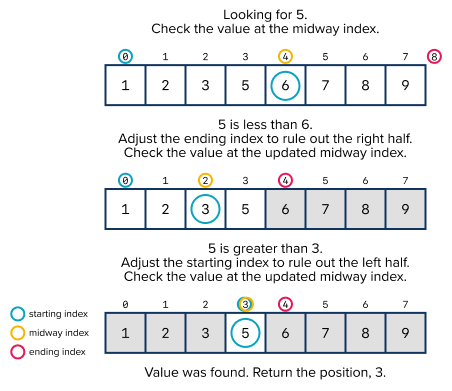
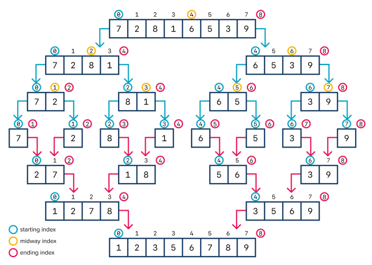
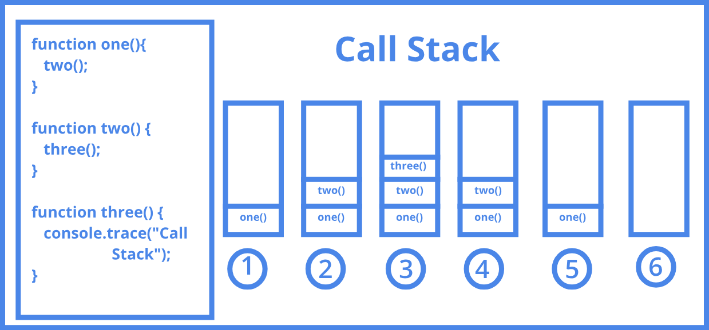
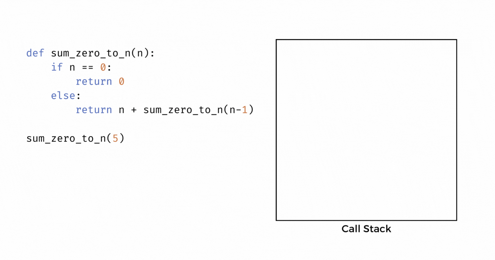

[https://courses.codepath.org/courses/tip101/unit/7#feedback-modal](https://courses.codepath.org/courses/tip101/unit/7#feedback-modal)
## Unit 7 Cheatsheet


Here’s a quick reference sheet for Unit 7. While not an exhaustive list, it highlights the key syntax and concepts you’ll use in this unit, plus a few optional ideas that may help with problem-solving. You’re still expected to know required material from earlier units.
Sections are labeled for clarity:


- ✅ In-Scope: May appear on the assessment

- 💡 Not In-Scope: Useful, but not required


### 🎯 Unit Goals


- Understand the difference between iterative and recursive problem solving approaches

- Implement solutions using a recursive technique

- Describe and apply a divide and conquer approach to problems

- Solve problems using binary search


### General Concepts ✅ In-Scope


### Python Syntax


#### Floor Division


The **`//` operator** is also known as [floor division](https://www.geeksforgeeks.org/floor-division-in-python/). `x // y` returns the result of `x` divided by `y` rounded down to the nearest whole integer.


Example Usage:


```python
print(5 // 2) # Prints 2 because 5 / 2 = 2.5 which rounded down is 2

print(10 // 2) # Prints 5 because 10 // 2 = 5 which is already an integer
```


### Recursion


Put simply, recursion is the process of a function calling itself.


Example Usage:


```python
def recursive_crash():
    print("I will run forever")
    recursive_crash()
```

If we call the function `recursive_crash()` above, it will print `"I will run forever"` and then call itself, causing the function to execute again. `"I will run forever"` will repeat again, and the function will call itself again. This will happen over and over until your program crashes.


#### Iteration vs Recursion


Like a for loop or while loop (also referred to as *iteration*), recursion is a way to repeatedly execute a chunk of code. In fact, recursion and iteration both achieve the same goal (repetition), but with inverse approaches.


Iteration uses a *bottom-up approach*. It begins by solving the smallest subproblem and then works it way up to solving larger and larger subproblems, working our way up to a solution to the overall problem.


In contrast, recursion uses a *top-down approach*. It takes the overall problem and breaks it apart into smaller and smaller subproblems until it finally finds one that can be solved readily. Then, if necessary, recursion follows the same pattern as iteration of using the subproblem solutions to build back up to the overall solution.


Example Usage:


| Iterative Approach | Recursive Approach |
| --- | --- |
| def count_iterative(num):
 i = 1
 while i <= num:
 print(f"Count {i}!")
 i += 1 | def count_recursive(num):
 print(f"Count {num}!")
 if num == 1:
 return
 else:
 count_recursive(num - 1) |
| Input: 5
 Output:
 "Count 1!"
 "Count 2!"
 "Count 3!"
 "Count 4!"
 "Count 5!" | Input: 5
 Output:
 "Count 5!"
 "Count 4!"
 "Count 3!"
 "Count 2!"
 "Count 1!" |


In the example above, the iterative approach uses a loop to repeat code. A loop variable `i` is initialized, and `Count {i}` is printed once. and then the function works forward, repeating the *loop body*. We move towards ending the repetition by *incrementing* `i` to a larger or larger value until the overall goal is achieved (printing `Count {i}` `i` number of times).


In contrast, the recursive function starts by printing the input value, `num`, then creates repetition by calling itself so that the *function body* repeats. It moves towards terminating the repetition by *decrementing* the argument `num` with each new function call, finally terminating the cycle of function calls with a `return` statement when we reach the smallest possible value for `num`, `1`.


#### Building a Recursive Function


Every recursive function has at least two main components:


- The **base case** End condition. Describes the condition and code that should run when we want our function to stop making recursive calls. Often the base case is the smallest subproblem of the overall problem we are working to solve.

- The **recursive case** Code to execute in all other cases. The recursive case calls the function again, but usually passes in a smaller or simpler input to move us closer to reaching the base case.


```python
def count_recursive(num):
    # Action to repeat
    print(f"Count {num}!")

    # Base Case: If num is 1 we want to stop counting down
    if num == 1:
        # Terminate the function by returning
        return

    # Recursive Case: If num is larger than 1
    else:
       # Call count_recursive() again, but decrement the input value by 1
       count_recursive(num - 1)
```

A recursive function may have multiple base cases. This is useful when we have multiple conditions under which we want to stop repeating our function body and want to specify different behavior for each condition.


Example Usage:


```python
# Check if a given value is odd
def is_odd(n):

  # Base Case 1: n is 0, which is not odd
  if n == 0:
    # Return False
    return False
  # Base Case 2: n is 1, which is odd
  if n == 1:
    # Return True
    return True

  # Recursive case: n is greater than 1
  else:
    # Check if the input subtracted by 2 is odd
    # If n - 2 is odd, n must also be odd
    return is_odd(n - 2)

test_odd_value = is_odd(5)
test_even_value = is_odd(6)

print(test_odd_value) # Prints True
print(test_even_value) # Prints False
```

A recursive function may also have multiple recursive cases. This is useful when we want to specify different behavior depending on some condition(s).


Example Usage:


```python
# Count the number of even values in a list
def count_evens(lst):
  # Base case: The list is empty
  if not lst:
    # There are 0 even values in the list
    return 0

  # Recursive Case 1: The first value in the list is even
  if lst[0] % 2 == 0:
    # Count of even values is 1 + the count of evens in the rest of the list
    return 1 + count_evens(lst[1:])
  # Recursive Case 2: The first value in the list is odd
  else:
    # Count of even values is the count of evens in the rest of the list
    return count_evens(lst[1:])

output = count_evens([1, 2, 3, 4])
print(output) # Prints 2
```

When we create iterative algorithms, we often use an accumulator variable to collect our final result.


Example Usage:


```python
def count_evens_iterative(lst):
    # Accumulator variable
    count = 0
    for num in lst:
        if num % 2 == 0:
            count += 1
    return count
```

In recursive functions, we instead use the return statement as our 'accumulator variable'. The return statements combines a specified return value for the current function call with the results of recursive calls to generate the final output value.


Example Usage:


```python
  if lst[0] % 2 == 0:
    # Count of even values is 1 + the count of evens in the rest of the list
    return 1 + count_evens(lst[1:])
```

In the snippet of the recursive implementation of `count_evens()` above, the output value is 1 plus the return value of `count_evens(lst[1:])`.


#### Recursive Driver and Helper Functions


It is common to want to pass in extra data to our recursive calls. In this case, we can create a recursive helper function that takes in additional parameters so that we can pass along this extra data.


Example Usage:


```python
def partition_evens_odds(lst):
  return recurse_partition(lst, [], [])

def recurse_partition(lst, evens, odds):
  if not lst:
      return evens, odds
  if lst[0] % 2 == 0:
      evens.append(lst[0])
  else:
      odds.append(lst[0])
  return recurse_partition(lst[1:], evens, odds)


lst = [1, 2, 3, 4, 5, 6, 7, 8, 9]
evens, odds = partition_evens_odds(lst)
print(evens) # Prints: [2, 4, 6, 8]
print(odds)  # Prints: [1, 3, 5, 7, 9]
```

`partition_even_odds()` takes in a given list and returns two new lists: one with all the odd values in the input list, and one with all the even values in the input list. It only accepts one parameter: the input list.


To solve the problem recursively, we need to pass in our result lists `evens` and `odds` to each recursive call so that we can append new values to the lists. But those lists don't exist yet! So we create a helper function that takes in two additional parameters, `evens` and `odds`. Then the main 'driver' function creates initial values (empty lists) to pass in as arguments and calls the helper function which executes the recursive logic.


If we were to initialize the empty lists and put any recursive function calls inside the main function, any additions to the list, would be overwritten by the recursive call


```python
def partition_evens_odds(lst):
    evens = [] # evens becomes an empty list every time we call the function
    odds = [] # odds becomes an empty list every time we call the function
    if not lst:
        return evens, odds
    if lst[0] % 2 == 0:
        evens.append(lst[0])
    else:
        odds.append(lst[0])
    return partition_evens_odds(lst[1:], evens, odds)
```

When we use recursive helper functions, the driver function usually does very little. It may handle a base case, but it's primary job is to make the first call to the recursive helper function, passing in initial values for any parameters the helper function needs that were not passed to the driver function. The helper function then does all the work!


We could solve this problem without the helper function:


```python
def partition_evens_odds(lst, evens, odds):
  if not lst:
      return evens, odds
  if lst[0] % 2 == 0:
      evens.append(lst[0])
  else:
      odds.append(lst[0])
  return partition_evens_odds(lst[1:], evens, odds)


lst = [1, 2, 3, 4, 5, 6, 7, 8, 9]
evens, odds = partition_evens_odds(lst, [], []) # User has to pass in empty lists to hold result
print(evens) # Prints: [2, 4, 6, 8]
print(odds)  # Prints: [1, 3, 5, 7, 9]
```

However, in this case the user needs to pass in an initial list for the `evens` and `odds` parameter, which doesn't provide a good user experience.


### Divide & Conquer Algorithms


Divide and Conquer is an algorithmic technique that solves problems by breaking the overall problem down into subproblems of the same type, solving each subproblem, and then combining the results to find the final answer.


The divide and conquer approach can be split into three basic steps:


- **Divide** the overall problem into smaller subproblems.

- Each subproblem should be solvable using the same technique.

- The goal is to divide the problem into the smallest possible subproblems.

- **Conquer** by solving each subproblem.

- Solve each subproblem (often using recursion).

- The smallest subproblems (base cases) can be solved directly without using recursion.

- **Combine** the solutions to each subproblem to find the final result.

- Combine the results of each subproblem to solve larger subproblems.

- The goal is to find the final answer by merging the results of larger and larger subproblems.


#### Binary Search


Binary search is one of the most classic examples of a divide and conquer algorithm. Binary search finds the location of a given target value within a sorted list by dividing the list in half at each step.Regardless of the size of the list, we reduce the area we need to search by half by using logic to determine which half of the list contains the target value at each step. This creates an incredibly efficient searching algorithm with just `O(log n)` time complexity!


Binary search can be split into the following steps:


- Check whether the middle value of the list is the target value.

- If the middle value is the target value, return the index of the middle/target value.

- Otherwise determine whether the target value should be in the left or right half of the sorted list by determining if it is smaller or larger than the target value.

- Perform a binary search on the half of the list that the target value must be in.

- If at any point, we have a list that is empty or of size 1 and still have not found our target value, we can return `None` or `-1` or some other value to indicate the target value is not in the list.





#### Merge Sort


Merge sort is another classic example of a divide and conquer algorithm. Merge sort is one of the most efficient sorting algorithms, sorting a given unsorted list in `O(n log n)` time.


Merge sort can can be split into the following steps:


- **Divide** the list into two halves at each step until we have sublists of length 1.

- **Conquer** each subproblem, by sorting each sublist (A sublist of length 1 is already sorted).

- **Combine** the sorted sublists by merging them together. Compare matching indices of two sublists to place them in sorted order.





### Bonus Concepts 💡 Not In-Scope


The following syntax is nice to know and may improve your code readability and deepen your understanding of this unit's topics. However, they are not *required* to solve any of the problems in this unit. These are **not in scope for the Unit 7 assessment**, and you do not need to memorize them! Click on the function to read more about how to use it.


- [Inner Functions](https://realpython.com/inner-functions-what-are-they-good-for/) Specialized Python syntax often used to create helper functions

- [List Comprehension](https://www.w3schools.com/python/python_lists_comprehension.asp) Specialized Python syntax used to create a new list using values of an existing list


#### The Call Stack


When we make function calls, the body of the called function may call other functions, which may themselves call even more functions.


For example, in the following snippet, `function_a()` calls `function_b()` which then calls `function_c()`.


```python
def function_c():
    print("I'm Function C!")
    print("Function C is done executing!")

def function_b():
    print("I'm Function B!")
    function_c()
    print("Function B is done executing!")

def function_a():
    print("I'm Function A!")
    function_b()
    print("Function A is done executing!")

function_a()
```

When one function calls a second function, the first function pauses executing any remaining steps until the second function is finished executing. Running the above example, results in the following output:


```
I'm Function A!
I'm Function B!
I'm Function C!
Function C is done executing!
Function B is done executing!
Function A is done executing!
```

To help keep track of what code it should run next, computers maintain a [call stack](https://en.wikipedia.org/wiki/Call_stack).



Source: [via Medium](https://medium.com/swlh/in-depth-introduction-to-call-stack-in-javascript-a07b8513bcc3)


Imagine functions as library books, and the call stack as a stack of library books we have checked out. Every time we make a new function call, the function gets added as a new book on the top of the stack. The computer always reads and executes any instructions inside the stack's topmost book first. When it finishes reading the book, it removes the book from the stack it returns it to the library.


When one function calls another function, it is akin to checking out a new book while the computer is busy reading another book. When this happens, the computer will put a bookmark in its current book and immediately start reading the new book. Once the computer finishes reading the new book, it is removed from the stack, and the computer goes back to reading the original book at its bookmarked place. When the computer has read all books in the stack, it means the program has finished executing!


#### Recursion and the Call Stack


Recursive functions repeatedly call themselves. The call stack works with recursive functions the same way as with non-recursive function calls, but instead of having a bunch of different books stacked on top of each other, it's like having a stack of multiple copies of the same book.





#### Recursion and Space Complexity


The call stack takes up memory! [Stacks](https://www.programiz.com/dsa/stack), including the call stack, are just a special type of list that insert and remove elements in a specific order. We can envision each function call as being an element in a list, which means the number of function calls our functions make affects our function's space complexity!


For example in the `sum_zero_to_n()` function pictured above, we can say `n` is the size of the input integer. Approximately `n` function calls get added to the call stack before we begin removing functions from the call stack, so the space complexity of `sum_zero_to_n()` is `O(n)`.


The call stack of non-recursive functions also takes up space, but it is almost always a constant amount of space.

[https://courses.codepath.org/courses/tip101/unit/7#feedback-modal](https://courses.codepath.org/courses/tip101/unit/7#feedback-modal)
## Unit 7 Resources


### Session Recordings


Check out our live session recordings:


- [Instructor Led Sessions Playlist](https://vimeo.com/showcase/12239071?fl=so&fe=fs) | Passcode: **codepath**

- [Study Hall Playlist](https://vimeo.com/showcase/12252539?fl=so&fe=fs) | Passcode: **codepath**

- [Fix-it Garage Playlist](https://vimeo.com/showcase/12252541?fl=so&fe=fs) | Passcode: **codepath**


**Note:** It may take up to 24-48 hours after the session has concluded to appear on the playlist.


### Guides & Cheatsheets Links


#### Breakout Solutions


- [Unit 7 Breakout Problem Solutions](https://github.com/codepath/compsci_guides/wiki/TIP101-Unit-7)


#### Cheatsheet


- [Unit 7 Cheatsheet](https://courses.codepath.org/courses/tip101/unit/7#!cheatsheet)


#### Mock Interview Questions


Below is a list of additional interview questions spanning *all units* you can work on for additional practice.


- [Mock Interview Questions](https://courses.codepath.org/snippets/tip101/mock_interview_questions)
