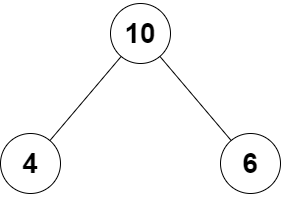

# Problem 1: Build a Binary Tree I

Given the following `TreeNode` class, create the binary tree depicted in the image below.





```python
class TreeNode:
    def __init__(self, val, left=None, right=None):
        self.val = val
        self.left = left
        self.right = right
```


<details>
  <summary>✨ <b>AI Hint: Binary Trees</b></summary>

  <br>

*Key Skill: Use AI to explain code concepts*


This problem requires you to understand binary trees. For a refresher on this topic, check out the Binary Trees section of the [Unit 8 Cheatsheet](https://courses.codepath.org/courses/tip101/unit/8#!cheatsheet).


If you need more help, try asking an AI tool like ChatGPT or GitHub Copilot to explain the concept of binary trees using a real-world analogy, and any following questions you have.


Once you grasp the idea, you can ask it to show you examples of binary trees in Python.
</details>
