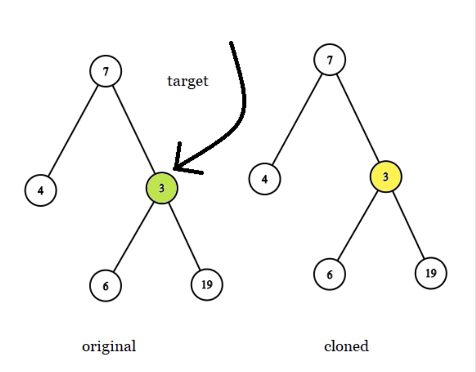
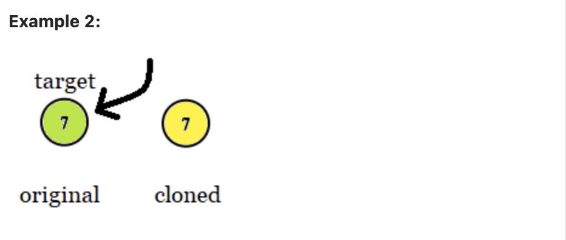
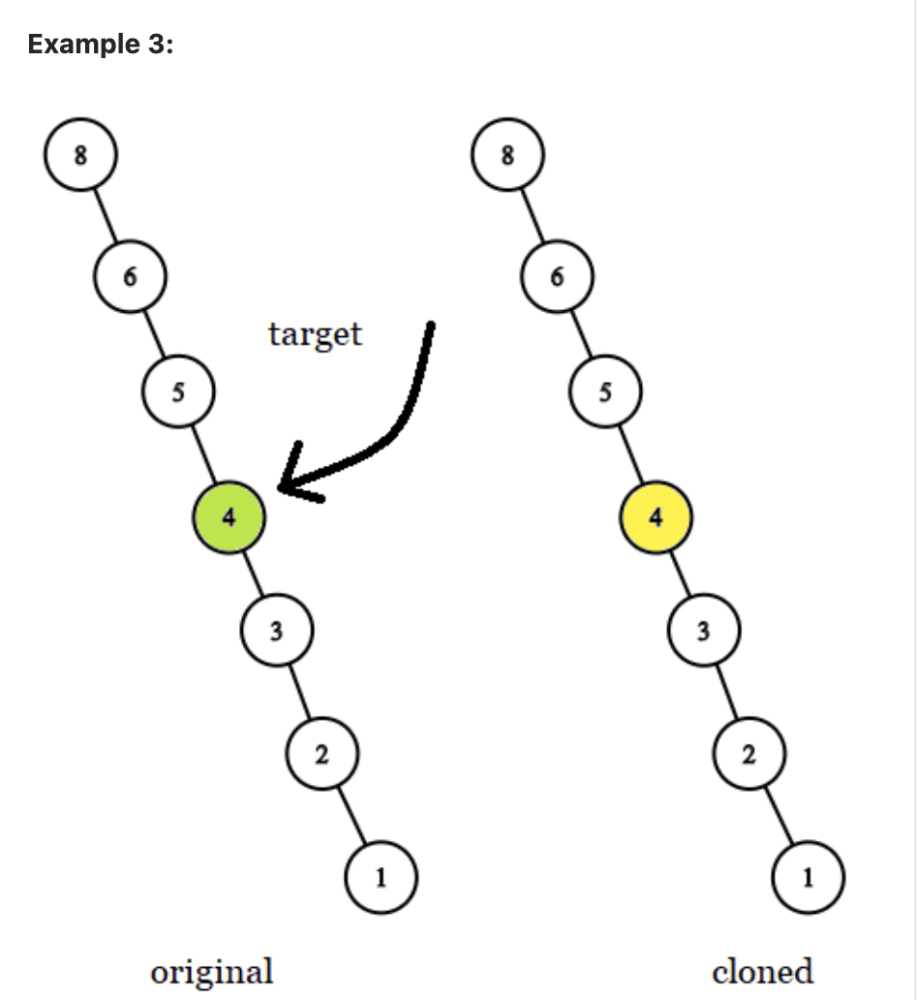

# Problem 2: Find Corresponding Node in Cloned Tree

You are given the `roots` of two binary trees, `original` and `cloned`. You are also give a `TreeNode` `target` which is a reference to a node in the `original` tree.


The cloned `tree` is a copy of the `original` tree.


Return a reference to the same node as `target` in the `cloned` tree.


You may not change any of the two trees or the `target node`. The answer must be a reference to a node in the cloned tree.


Evaluate the time complexity of your function.


```python
class TreeNode:
    def __init__(self, val=0, left=None, right=None):
        self.val = val
        self.left = left
        self.right = right


def get_target_copy(original, cloned, target):
	pass
```

Example 1:



```python
Input: tree = [7,4,3,null,null,6,19], target = 3
Output: 3
Explanation: In all examples the original and cloned trees are shown.
The target node is a green node from the original tree.
The answer is the yellow node from the cloned tree.
```

Example 2:



```python
Input: tree = [7], target =  7
Output: 7
```

Example 3:



```python
Input: tree = [8,null,6,null,5,null,4,null,3,null,2,null,1], target = 4
Output: 4
```
