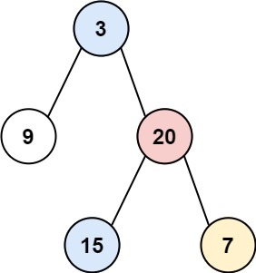
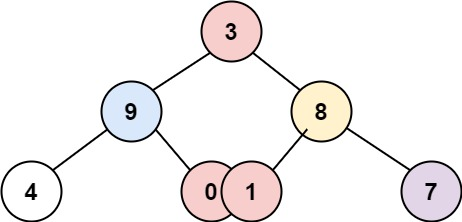
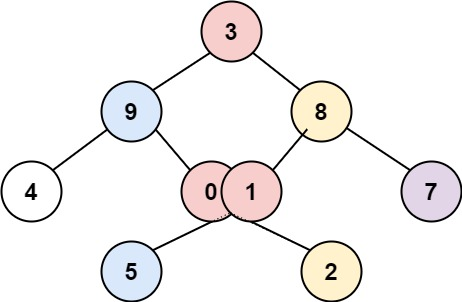

# Problem 4: Vertical Order Traversal of Binary Tree

Given the `root` of a binary tree, return the vertical order traversal of its nodes’ values. (i.e., from top to bottom, column by column).
If two nodes are in the same row and column, the order should be from left to right.


Evaluate the time complexity of your solution. Define your variables and give a rationale as to why you believe your solution has the stated time complexity.


```python
class TreeNode:
    def __init__(self, value=0, left=None, right=None):
        self.val = value
        self.left = left
        self.right = right

def vertical_order(root):
	pass
```

Example Usages:





```python
Input: root = [3,9,20,null,null,15,7]
Output: [[9],[3,15],[20],[7]]
```




```python
Input: root = [3,9,8,4,0,1,7]
Output: [[4],[9],[3,0,1],[8],[7]]
```




```python
Input: root = [3,9,8,4,0,1,7,null,null,null,2,5]
Output: [[4],[9,5],[3,0,1],[8,2],[7]]
```
