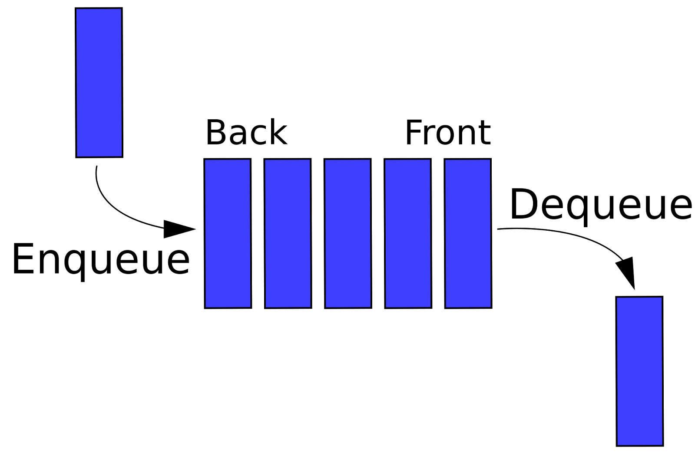
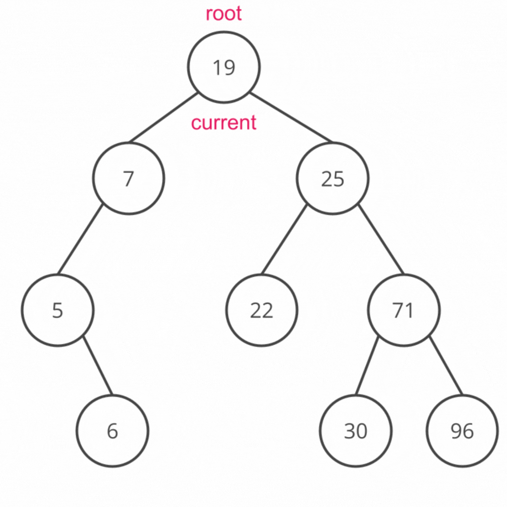

[https://courses.codepath.org/courses/tip101/unit/9#feedback-modal](https://courses.codepath.org/courses/tip101/unit/9#feedback-modal)
## Unit 9 Cheatsheet


Here’s a quick reference sheet for Unit 9. While not an exhaustive list, it highlights the key syntax and concepts you’ll use in this unit, plus a few optional ideas that may help with problem-solving. You’re still expected to know required material from earlier units.
Sections are labeled for clarity:


- ✅ In-Scope: May appear on the assessment

- 💡 Not In-Scope: Useful, but not required


### General Concepts ✅ In-Scope


### Python Syntax


#### Absolute Value


**`abs(x)`** Returns the absolute value of a given number. The absolute value of a number is the distance of that number from 0. [**Try it**](https://www.w3schools.com/python/ref_func_abs.asp)


- Accepts one parameter `x`: the number you would like the absolute value of


Example Usage:


```python
# Example #1: Absolute value of a number
abs(-10) # Returns 10

# Example #2: Absolute value of an expression
abs(10 - 20) # Returns 10
```


#### Infinity


We can represent positive and negative infinity with the following syntax.


```python
positive_infinity = float('inf')

negative_infinity = float('-inf')
```

Infinity is often used as an initial value when finding some unknown value, especially a minimum or maximum value.


Example Usage:


```python
lst = [5, 4, 3, 2, 1]

def get_min(lst):
    minimum = float('inf')
    for num in lst:
        if num < minimum:
            minimum = num

    return minimum
```

In the above example, infinity is used to find the minimum value in a list of numbers. We assume the minimum is the largest number possible (infinity), then update our assumption as we iterate through the list and find values lower than infinity.


Infinity is also commonly used as a return value to handle edge cases.


Example Usage:


```python
def safe_divide(a, b):
    if b == 0:
        if a > 0:
            return float('inf')
        else:
            return float('-inf')
    return a / b
```

In the above example infinity is used to gracefully handle cases where a user tries to divide a number by zero. Normally, dividing a number by zero would result in Python raising a `ZeroDivisionError`.


#### Queues


**Queues** are a special type of list where elements are always added and removed in a certain order. Queues follow the First In, First Out (FIFO) principle, which means that the first element added to the queue will be the first element to be removed.


The term 'queue' comes from the British meaning of the word queue: a line of waiting people. Queue data structures follow the same logic as queues of real people! Imagine that each element in the queue is a person. New people add themselves to the end of the line and must wait until all of the people ahead of them have exited the line before they can exit the line. The person who has been waiting in line the longest is the first person to exit the line.


Practically speaking, this means that new elements are always appended to the end of a queue and removed from the beginning of the queue.



Source: [via Key to Programming](http://key-to-programming.blogspot.com/2015/02/queue-data-structure-queue-ds-queue.html)


In Python, we use the [`deque` class](https://docs.python.org/3/library/collections.html#collections.deque) to create a new Queue.


Example Usage:


```python
# 1. Import the deque module
from collections import deque

# 2. Initialize a new deque object
queue = deque()

#3. Add a new element, 1, to the end (right side) of the queue
queue.append(1)

#4. Remove an element from the beginning (left side) of the queue
removed_elt = queue.popleft()
print(removed_elt) # Prints 1
```

The above example can be broken down as follows:


- The `deque` class is part of the `collections` library in Python. A library is a collection of pre-written code that we can import into our own programs. Importing gives us access to use the classes, functions, etc. defined inside the library.

- Create a new instance of the `deque` class.

- The `deque` class has a method [`append()`](https://docs.python.org/3/library/collections.html#collections.deque.append) that adds a new element to the end of the queue. `append()` has one parameter, the value we want to append to the queue.
We use dot notation to append the integer `1` to our `deque` instance `queue`.

- The `deque` class also has a method [`popleft()`](https://docs.python.org/3/library/collections.html#collections.deque.popleft) that removes and returns the element at the beginning of the queue.
We use dot notation to remove the element at the beginning of our `deque` instance `queue` (in this case `1` since there is only one element in the queue).


It is equally valid to add elements to the beginning of the queue and pop elements from the end. We can use the `appendleft()` and `pop()` elements to do this. The important thing is that we append and pop elements from *opposite ends* of the queue.


Example Usage:


```python
# Import the deque module
from collections import deque

# Initialize a new deque object
queue = deque()

#3. Add a new element, 1, to the left side of the queue
queue.appendleft(1)

#4. Remove an element from the right side queue
removed_elt = queue.pop()
print(removed_elt) # Prints 1
```

It is also possible to model a queue using a normal list. However, we generally prefer to use `deque` as it optimizes time complexity so it is an `O(1)` operation to remove nodes from the beginning of the queue and an `O(1)` operation to add nodes to the end of the queue (under the hood, `deque` is implemented using a linked list!).


### Breadth First Search


Breadth First Search (BFS), also known as Level Order Traversal, is a method for visiting all the nodes in a tree. In a breadth first search approach, we visit nodes level by level. We begin by traversing the tree's root node, then traversing the root's direct children from left to right, followed by the root's grandchildren, etc.





In the diagram above, nodes that are outlined in pink have been added to the queue. Nodes shaded in pink have been visited and removed from the queue. The root node, at level 1, is visited first. Then the root node's children at level 2, nodes 7 and 25, are visited. The pattern continues until the nodes have been explored in the following order: `[19, 7, 25, 5, 22, 71, 6, 30, 96]`.


BFS is typically implemented iteratively using a queue. The pseudocode for a Breadth First Search is as follows:


```python
If the tree is empty:
    return an empty list

Create an empty queue
Create an empty list to store visited nodes

Add the root into the queue

While the queue is not empty:
    Pop the next node off the queue
    Add the popped node to the list of visited nodes

    Add the popped node's left child to the queue
    Add the popped node's right child to the queue
```

BFS can also be implemented recursively, but an iterative, queue based implementation is generally preferred because the order in which BFS visits nodes in a tree matches the FIFO insertion/removal order of a queue.


### How to Pick a Traversal Method


There are four standard traversal algorithms for a binary tree. The first three - preorder, inorder, and postorder - are all depth first search traversals. The final algorithm is a breadth first search traversal.


For many problems, any traversal algorithm will lead to a solution. However, there are certain cases where a particular algorithm is preferred.


**Depth First Search**


In general, depth first search algorithms are preferred when the solution is expected to be deeper within the tree since the algorithm follows one branch as far as possible before backtracking and exploring other paths. In these scenarios, a breadth first approach may still find a solution, but more slowly since it traverses nodes closest to the root first.


Inorder traversals are commonly used for finding leaves, the height of the tree, or the diameter of the tree.


**Inorder**


Given a binary search tree, inorder will traverse the nodes in sorted ascending order.


Inorder traversals are commonly used for binary search tree tasks or converting a binary search tree to a sorted list.


**Preorder**


Given a binary tree, preorder will process the root of the tree before either subtree. It also processes nodes in the order they were inserted into the tree.


Preorder traversals are commonly used for tree copying, expression tree evaluation, and serializing a tree.


**Postorder**


Given a binary tree, postorder will process the subtrees before the root.


Postorder traversals are commonly used for deleting a tree and expression tree evaluation.


**Breadth First Search**


Given a binary tree, breadth first search traverses nodes higher up in the tree (closest to the root) first. It is preferred when you expect the solution to be closer to the root. It also explores nodes level by level, from left to right.


Breadth first search is commonly used for problems that require traversing by level.


### Bonus Concepts 💡 Not In-Scope


The following syntax is nice to know and may improve your code readability and deepen your understanding of this unit's topics. However, they are not *required* to solve any of the problems in this unit. These are **not in scope for the Unit 9 assessment**, and you do not need to memorize them! Click on the function to read more about how to use it.


- [**Throwaway Variable**](https://www.geeksforgeeks.org/underscore-_-python/) Used to ignore values. Commonly used when a function returns multiple values but the user is only interested in one or when the loop variable is not needed inside the body of the for loop.

- [**Inner Functions**](https://realpython.com/inner-functions-what-are-they-good-for/) Specialized Python syntax often used to create helper functions

[https://courses.codepath.org/courses/tip101/unit/9#feedback-modal](https://courses.codepath.org/courses/tip101/unit/9#feedback-modal)
## Unit 9 Resources


### Session Recordings


Check out our live session recordings:


- [Instructor Led Sessions Playlist](https://vimeo.com/showcase/12239071?fl=so&fe=fs) | Passcode: **codepath**

- [Study Hall Playlist](https://vimeo.com/showcase/12252539?fl=so&fe=fs) | Passcode: **codepath**

- [Fix-it Garage Playlist](https://vimeo.com/showcase/12252541?fl=so&fe=fs) | Passcode: **codepath**


**Note:** It may take up to 24-48 hours after the session has concluded to appear on the playlist.


### Guides & Cheatsheets Links


#### Breakout Solutions


- [Unit 9 Breakout Problem Solutions](https://github.com/codepath/compsci_guides/wiki/TIP101-Unit-9)


#### Cheatsheet


- [Unit 9 Cheatsheet](https://courses.codepath.org/courses/tip101/unit/9#!cheatsheet)


#### Mock Interview Questions


Below is a list of additional interview questions spanning *all units* you can work on for additional practice.


- [Mock Interview Questions](https://courses.codepath.org/snippets/tip101/mock_interview_questions)
