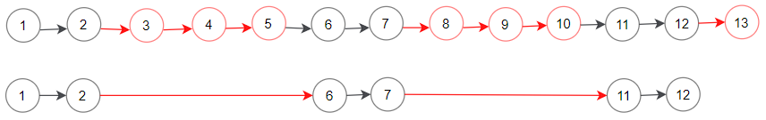
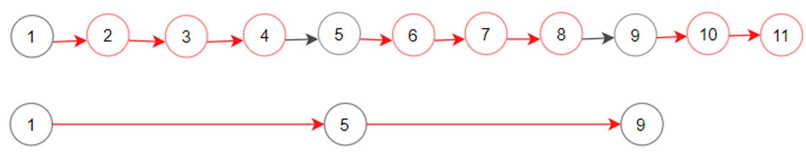

# Problem 3: Delete N Nodes after M Nodes

You are given the `head` of a linked list and two integers `m` and `n`.


Traverse the linked list and remove some nodes in the following way:


- Start with the head as the current node.

- Keep the first `m` nodes starting with the current node.

- Remove the next `n` nodes

- Keep repeating steps 2 and 3 until you reach the end of the list.


Return *the head of the modified list after removing the mentioned nodes*.


```python
class Node:
    def __init__(self, val=0, next=None):
        self.value = val
        self.next = next

def delete_nodes(head, m, n):
	pass
```

Example #1:



```python
Input List #1:
1 -> 2 -> 3 -> 4 -> 5 -> 6 -> 7 -> 8 -> 9 -> 10 -> 11 -> 12 -> 13
Input: head = 1, m = 2, n = 3
Expected Output: 1
Expected Output List: 1 -> 2 -> 6 -> 7 -> 11 -> 12
Explanation: Keep the first (m = 2) nodes starting from the head of the linked List
(1 ->2) show in black nodes.
Delete the next (n = 3) nodes (3 -> 4 -> 5) show in read nodes.
Continue with the same procedure until reaching the tail of the Linked List.
Head of the linked list after removing nodes is returned.
```

Example #2:



```python
Input List #2:
1 -> 2 -> 3 -> 4 -> 5 -> 6 -> 7 -> 8 -> 9 -> 10 -> 11
Input: head = 1, m = 1, n = 3
Expected Output: 1
Expected Output List: 1 -> 5 -> 9
```
