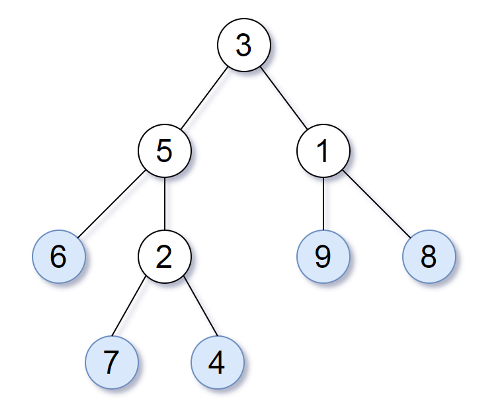

# Problem 4: Leaf-Similar Trees

Consider all the leaves of a binary tree, from left to right order, the values of those leaves form a **leaf value sequence.**


```python
class TreeNode:
    def __init__(self, val=0, left=None, right=None):
        self.val = val
        self.left = left
        self.right = right

def leaf_similar(root1, root2):
	pass
```




For example, in the given tree above, the leaf value sequence is `(6, 7, 4, 9, 8)`.


Two binary trees are considered *leaf-similar* if their leaf value sequence is the same.


Return `True` if and only if the two given trees with root nodes `root1` and `root2` are leaf-similar. Otherwise, return `False`.


Example Usage:


```python
Input Tree #1:

        root1                   root2
          3                       3
         / \                     / \
        /   \                   /   \
       /     \                 /     \
      5       1               5       1
     / \     / \             / \     / \
    6   2   9   8           6   7   4   2
       / \                             / \
      7   4                           9   8

Input: root1 = 3, root2 = 3
Output: True

Input Tree #2

       root1           root2
          1               1
         / \             / \
        2   3           3   2

Input: root1 = 1, root2 = 1
Output: False
```
