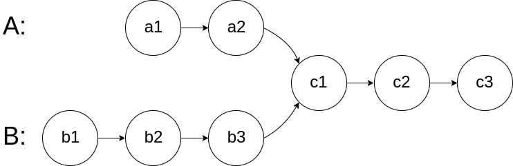

# Problem 2: Intersection of Two Linked Lists

Given the heads of two singly linked lists, return the node at which the two lists intersect. If the two linked lists do not intersect, return `None`. You may not modify either of the linked lists.


```python
class Node:
    def __init__(self, val = 0, next_node = None):
        self.val = val
        self.next = next_node

def find_intersection(headA, headB):
	pass
```


