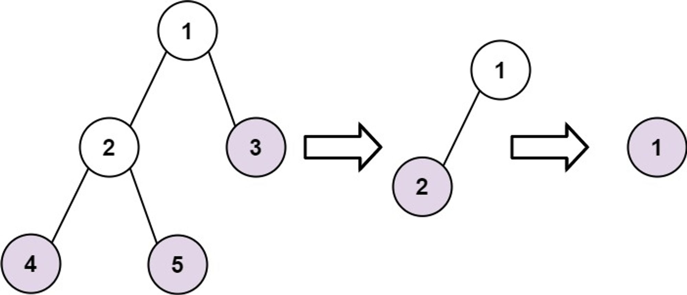

# Problem 4: Leaves of a Binary Tree

Given the `root` of a binary tree, collect a tree's nodes as if you were doing this:


- Collect all the leaf nodes.

- Remove all the leaf nodes.

- Repeat until the tree is empty.


```python
class TreeNode:
    def __init__(self, val=0, left=None, right=None):
        self.val = val
        self.left = left
        self.right = right

def find_leaves(root):
	pass
```




Example Usage:


```python
Example
Input: root = 1
Output: [[4, 5, 3], [2], [1]]
Explanation:
[[3,5,4],[2],[1]] and [[3,4,5],[2],[1]] are also considered correct answers
since per each level it does not matter the order on which elements are returned.
```
