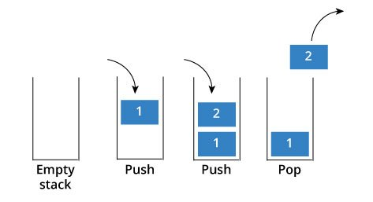

[https://courses.codepath.org/courses/tip101/unit/10#feedback-modal](https://courses.codepath.org/courses/tip101/unit/10#feedback-modal)
## Unit 10 Cheatsheet


Here’s a quick reference sheet for Unit 10. While not an exhaustive list, it highlights the key syntax and concepts you’ll use in this unit, plus a few optional ideas that may help with problem-solving. You’re still expected to know required material from earlier units.
Sections are labeled for clarity:


- ✅ In-Scope: May appear on the assessment

- 💡 Not In-Scope: Useful, but not required


### General Concepts ✅ In-Scope


### Python Syntax


#### Inner/Nested Functions


An [Inner Function](https://www.freecodecamp.org/news/nested-functions-in-python/), also called a nested function, is a function defined inside of another function.


Example Usage:


```python
# Outer function
def print_sum(x, y):

    # Inner function
    def get_sum():
        return x + y

    total = get_sum()
    print(f"{x} + {y} is {total}")

print_sum(1, 2) # Prints: 1 + 2 is 3
```

The inner function has access to any variables and parameters defined by the outer function. In the example above, the inner function `get_sum()` has access to `print_sum()`'s parameters even though they are not passed in to `get_sum()`.


Inner functions are only available within the scope of the outer function. They are commonly used to define helper functions that will only be called by the main function, and won't be used anywhere else in the program.


Example Usage:


```python
class TreeNode:
    def __init__(self, val=0, left=None, right=None):
        self.val = val
        self.left = left
        self.right = right

def inorder_traversal(root):
    def inorder(node, result):
        if node:
            inorder(node.left, result)  # Traverse the left subtree
            result.append(node.val)     # Visit the root
            inorder(node.right, result) # Traverse the right subtree

    result = []
    inorder(root, result)
    return result
```

The function `inorder_traversal()` above returns the inorder traversal of a node's values as a list. The logic of the helper function `inorder()` is specific to conducting an inorder traversal and is unlikely to be used anywhere else in the program. Encapsulating `inorder()` within `inorder_traversal()` as an inner function can help keep code organized and modular.


#### Ternary Operators


A [ternary operator](https://www.geeksforgeeks.org/ternary-operator-in-python/) is special shorthand syntax that allows us to write simple if-else conditions on a single line.


The general syntax for a single line if-else statement is:


```python
value_if_true if condition else value_if_false
```

Example Usage:


```python
a = 10
b = 20

# ternary operator
max_value = a if a > b else b

# normal conditional syntax
if a > b:
    max_value = a
else:
    max_value = b
```


#### List Comprehensions


A [List Comprehension](https://www.w3schools.com/python/python_lists_comprehension.asp) is special shorthand syntax that provides a concise way to create a new list based on values from another list.


The general syntax for a list comprehension is:


```python
[new_list_value for item in existing_list]
```

Example Usage:


```python
numbers = [1, 2, 3, 4, 5]

# List comprehension syntax
squared_numbers = [num**2 for num in numbers]

print(squared_numbers) # Prints: [1, 4, 9, 16, 25]

# For loop syntax
squared_numbers = []
for num in numbers:
    squared_numbers.append(num ** 2)

print(squared_numbers) # Prints: [1, 4, 9, 16, 25]
```

The syntax can be expanded to filter elements from the original list using a conditional statement. The general expanded syntax is:


```python
[new_list_value for item in existing_list if condition]
```

Example Usage:


```python
numbers = [1, 2, 3, 4, 5, 6, 7, 8, 9, 10]

# Only square numbers less than 5
squared_numbers = [num**2 for num in numbers if num < 5 ]

print(squared_numbers) # Prints: [1, 4, 9, 16]

# For loop syntax
squared_numbers = []
for num in numbers:
    if num < 5:
        squared_numbers.append(num ** 2)

print(squared_numbers) # Prints: [1, 4, 9, 16]
```

We can also use the same concept to perform a dictionary comprehension. The general syntax for a dictionary comprehension is:


```python
{key_expression: value_expression for item in iterable if condition}
```

Example Usage:


```python
numbers = [1, 2, 3, 4, 5, 6, 7, 8, 9, 10]

# Dictionary comprehension syntax
squared_dict = { num : num **2 for num in numbers if num < 5}

print(squared_dict) # Prints {1: 1, 2: 4, 3: 9, 4: 16}

# For loop syntax
squared_dict = {}
for num in numbers:
    if num < 5:
        squared_dict[num] = num ** 2
print(squared_dict) # Prints {1: 1, 2: 4, 3: 9, 4: 16}
```

In the above example, a dictionary comprehension is used to map each number in the list of integers `numbers` to its square as long as the number is less than 5.


### Bonus Concepts 💡 Not In-Scope


### Stacks


**Stacks** are a special type of list where elements are always added and removed in a certain order. Stacks follow the Last In, First Out (LIFO) principle, which means that the last element added to the stack will be the first element to be removed.


Imagine the stack data structure as a stack of plates. When we add a new plate (element) to the stack, the plate gets added to the top of the existing stack. When we want to remove a plate from the stack, the plate that is easiest to remove is the plate on the top of the stack.


Adding a new element to the stack is also called *pushing* the element on to the stack. Removing an element from the stack is also called *popping* the element off of the stack.



Source: [via Python Pool](https://www.pythonpool.com/python-stack/)


#### Stack Implementation


Stacks can easily be implemented using the built-in list data type in Python and built-in `append()` and `pop()` methods.


```python
stack = []

# Push new items onto the top of the stack
stack.append(1)
stack.append(2)

# Pop an item off the top of the stack
popped_item = stack.pop()

print(popped_item) # Prints: 2
print(stack) # Prints: [1]
```

Because `append()` and `pop()` both have `O(1)` time complexity, using a normal Python list to implement a stack is already extremely efficient. There is no need to use an extra library like we did for queues with `deque` to increase efficiency.


#### Stacks vs Queues


Stacks and [Queues](https://courses.codepath.org/courses/tip101/unit/9#!cheatsheet) are both special types of lists that maintain certain properties about insertion and removal order.


Problems solved with a stack are often implement a *recursive* solution, because under the hood, computers use a stack data structure to track the sequence of recursive function calls. When we initiate a series of recursive calls, we are essentially making a stack. Every time a recursive call is made, a new element - the function call and any arguments it is passed - is added on to the stack. The stack the computer uses to track function calls is referred to as the [call stack](https://courses.codepath.org/courses/tip101/unit/7#!cheatsheet).


In contrast, problems solved using queues generally use an *iterative* solution involving a while loop.


Although stack problems are often solved recursively, they may always be solved iteratively.


Example Usage:


```python
# Reverse a string using a iterative stack solution
def reverse_string_iterative(s):
    stack = []

    # Push all characters of the string onto the stack
    for char in s:
        stack.append(char)

    reversed_string = ""

    # Pop all characters from the stack and append to the result
    while stack:
        reversed_string += stack.pop()

    return reversed_string

# Reverse a string using a recursive stack solution
def reverse_string_recursive(s):
    # Base case: if the string is empty or has only one character
    if len(s) <= 1:
        return s

    # Recursive case: reverse the rest of the string and append the first character to the end
    # reverse_string_recursive(s[1:]) is added to call stack
    return reverse_string_recursive(s[1:]) + s[0]
```


### Sets


Sets are a built-in data structure in Python that represent an unordered collection of unique elements. They are often used to track seen values, eliminate duplicates, and find overlap between multiple pieces of data.


Sets maintain the following characteristics:


- **Unordered**: Sets do not maintain any particular order of elements (i.e. they are not indexed like lists or strings).

- **Unique elements**: Every element in a set must be unique. If a duplicate value is added to a set, the set will automatically remove the duplicate.

- **Mutable**: Sets can be modified. Values can be added or removed without needing to make a new set.

- **Iterable**: Sets can be iterated over using a loop


A new set can be created using curly braces `{}` or using the `set()` function.


Example Usage:


```python
# Create a new Set
my_set = {1, 2, 3, 4}

# Using the set() function
another_set = set([1, 2, 3, 4])

# Creating an empty set
empty_set = set()  # Note: {} creates an empty dictionary, not a set
```

We can operate on a set using the following basic functions:


- **`add()`**: Adds an element to the set.

- **`remove()`**: Removes an element from the set. Raises a `KeyError` if the element is not found.

- **`discard()`**: Removes an element if it is present, without raising an error if it is not found.

- **`clear()`**: Removes all elements from the set.


Example Usage:


```python
my_set = {1, 2, 3}

my_set.add(4)       # {1, 2, 3, 4}
my_set.remove(2)    # {1, 3, 4}
my_set.remove(5)    # Raises KeyError
my_set.discard(5)   # {1, 3, 4} - No error if element not found
my_set.clear()      # {}
```

Sets support various mathematical operations such as union, intersection, difference, and symmetric difference


- **Union: `a | b`**: Returns the set of elements contained in *either* set `a` or set `b`.

- **Intersection: `a & b`**: Returns the set of elements contained in *both* set `a` or set `b`.

- **Difference: `a - b`**: Returns the set of elements contained in set `a` *but not in* set `b`.

- **Symmetric Difference: `a ^ b`**: Returns the set of elements contained in *either* set `a` or set `b` but *not in both*.


```python
set1 = {1, 2, 3}
set2 = {3, 4, 5}

# Union: Elements in either set
union_set = set1 | set2           # {1, 2, 3, 4, 5}

# Intersection: Elements common to both sets
intersection_set = set1 & set2    # {3}

# Difference: Elements in set1 but not in set2
difference_set = set1 - set2      # {1, 2}

# Symmetric Difference: Elements in either set, but not both
symmetric_difference_set = set1 ^ set2  # {1, 2, 4, 5}
```

[https://courses.codepath.org/courses/tip101/unit/10#feedback-modal](https://courses.codepath.org/courses/tip101/unit/10#feedback-modal)
## Unit 10 Resources


### Session Recordings


Check out our live session recordings:


- [Instructor Led Sessions Playlist](https://vimeo.com/showcase/12239071?fl=so&fe=fs) | Passcode: **codepath**

- [Study Hall Playlist](https://vimeo.com/showcase/12252539?fl=so&fe=fs) | Passcode: **codepath**

- [Fix-it Garage Playlist](https://vimeo.com/showcase/12252541?fl=so&fe=fs) | Passcode: **codepath**


**Note:** It may take up to 24-48 hours after the session has concluded to appear on the playlist.


### Guides & Cheatsheets Links


#### Breakout Solutions


- [Unit 10 Breakout Problem Solutions](https://github.com/codepath/compsci_guides/wiki/TIP101-Unit-10)


#### Cheatsheet


- [Unit 10 Cheatsheet](https://courses.codepath.org/courses/tip101/unit/10#!cheatsheet)


#### Mock Interview Questions


Below is a list of additional interview questions spanning *all units* you can work on for additional practice.


- [Mock Interview Questions](https://courses.codepath.org/snippets/tip101/mock_interview_questions)
